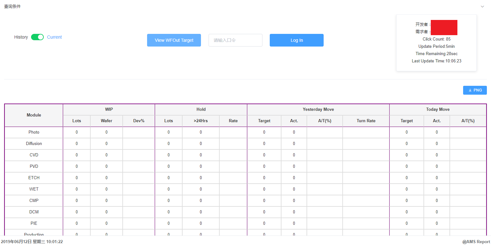

# AMSRPT
AMSRPT System

这是我的第一个Web项目。在AMS公司因为RPT（报表）系统的需求，开发网页。公司采购了IBM的Cognos开发工具，该工具使用拖拉拽的方式开发网页，在我看来开发方式极
其落后且难以维护、难以开发出客户需求的效果，所以我主动提出自己建站完成这个项目。由于第一次开发web，js、h5都没有实战过，所以项目中掺杂了比较多的第三方js，
这是由于在开发过程中探索js方面的技术。

使用了以下技术（或框架）：
* ASP.Net MVC
* Element UI
* jQuery.js
* vue.js
* easyui.js(部分页面)
* 其他第三方js代码

